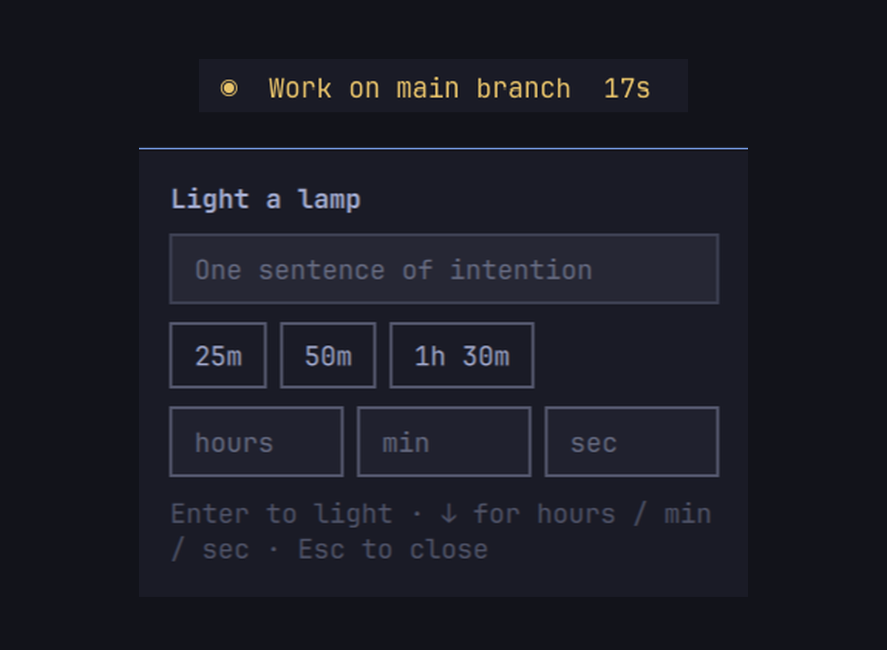
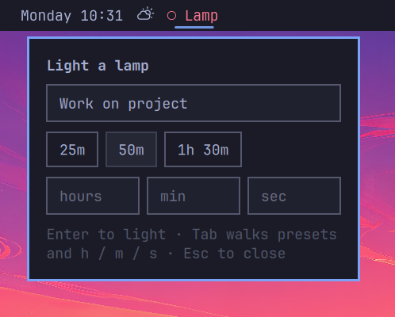

# Lamp

Light a session with one sentence of intention.



The bar holds a quiet flame and an elapsed clock until you put it out. When you extinguish it, Lamp asks what moved, then appends a page to a local markdown journal. No account. No network. No extra packages.

This is the opposite of a streak tracker. It does not block websites, swap your wallpaper, or start a 25-minute timer. It gives the desktop a beginning and an end.

## Why this exists

The Omarchy marketplace already has clocks, sports scores, AI usage meters, marketplace browsers, website blockers, pomodoros, workspace modes, and desktop pets.

What it does not have is a *session*.

Omarchy is an agentic OS that still belongs to a person. Lamp is the human half of that sentence: you say what this stretch of time is for, you do the work, you write one line about what actually moved. Agents can keep running. The machine remembers the work as prose, not as a dashboard.

## Install

```bash
omarchy plugin add https://github.com/saipraneethpb1/omarchy-lamp.git --enable
```

Then place **Lamp** in the bar from `Setup > Plugins` if it is not already there, or:

```bash
omarchy plugin enable saipraneethpb1.lamp --section center
```

Summon without the bar:

```bash
omarchy-shell shell toggle saipraneethpb1.lamp '{}'
```

Optional keybind in `~/.config/hypr/bindings.lua` after checking `omarchy menu keybindings --print`:

```lua
o.bind("SUPER + SHIFT + L", "Lamp", "omarchy-shell shell toggle saipraneethpb1.lamp '{}'")
```

## Use

1. Click the bar or hit the keybind.
2. Type one sentence. Example: `Finish the marketplace submission for Lamp`.
3. Optionally give yourself a time: click `25m` / `50m` / `1h 30m`, or press
   `Tab` (or `↓`) and fill in hours, minutes, and seconds. Leave them blank
   for no limit.
4. Enter lights it. The bar reads `◉ Finish the marketplace…  47m 12s`.
5. Past the time you set, the bar turns red — the lamp is still lit and the
   clock keeps running, you are just over. Nothing interrupts you.
6. Click again when you stop. Type what moved, or leave it blank.
7. Escape closes the overlay without changing the session.

`Tab` and `Shift+Tab` walk every control — the sentence, the presets, and the
hour/minute/second fields — so the whole thing is reachable without a mouse.
A focused preset takes `Enter` or `Space`.



In the bar panel, tabbing past the last field hands focus on to the next bar
panel the way every other Omarchy widget does; in the fullscreen overlay it
wraps back to the top.

## Files it writes

| Path | What |
|---|---|
| `~/.local/state/omarchy/lamp/session.json` | Current flame, with its time limit |
| `~/.local/share/omarchy-lamp/YYYY-MM-DD.md` | Daily journal |

Both stay on this machine. Removal does not delete them.

### Journal folder

The journal folder is configurable — point it at an Obsidian vault, a synced
folder, or anywhere else you keep notes. Set `journalDir` on Lamp's entry in
`~/.config/omarchy/shell.json`:

```json
{ "id": "saipraneethpb1.lamp", "journalDir": "~/Documents/Vault/Work Log" }
```

Then `omarchy-shell shell reloadConfig`. `~` and `$VARS` are expanded, the
folder is created on demand, and an empty or missing value keeps the default
above. Pages already written stay where they are — this only changes where the
next one lands.

The folder must be yours and must not be group- or world-writable, and today's
page must be a regular file rather than a link. Lamp refuses to write and says
why otherwise, because the daily filename is predictable: on a shared machine
anyone who could write into that folder could pre-create it pointing somewhere
else. A symlinked path to the folder itself is fine — that is resolved first.

The helper takes the same setting directly, which is handy for scripting:

```bash
python3 scripts/lamp.py extinguish --journal-dir ~/Vault/Work "what moved"
```

Example journal page:

```markdown
# 2026-09-04

## 2026-09-04T10:41:00+05:30 → 2026-09-04T12:03:00+05:30

**Intention:** Finish the marketplace submission for Lamp

**Planned:** 1h 30m

**What moved:** Manifest, overlay, and the first honest README
```

## Changelog

[CHANGELOG.md](CHANGELOG.md), also published as
[releases](https://github.com/saipraneethpb1/omarchy-lamp/releases).
`omarchy plugin update saipraneethpb1.lamp` moves you to the latest commit on
`main`; tags are there if you would rather pin.

## Requirements

- Omarchy Quattro (`omarchy-shell`)
- Python 3 from the Omarchy install (stdlib only)
- No network, no extra packages, no sudo, no install hook

## Remove

```bash
omarchy plugin disable saipraneethpb1.lamp
omarchy plugin remove saipraneethpb1.lamp
```

Or by hand:

```bash
rm -rf ~/.config/omarchy/plugins/saipraneethpb1.lamp
omarchy-shell shell rescanPlugins
```

Optional cleanup of local pages:

```bash
rm -rf ~/.local/state/omarchy/lamp ~/.local/share/omarchy-lamp
```

## Validate

```bash
omarchy plugin validate .
python3 scripts/test_lamp.py
```

## Security

Lamp runs inside `omarchy-shell` with your user permissions, like every other plugin. The helper `scripts/lamp.py` only reads and writes the two paths above, or the journal folder you point it at, and it verifies that folder is private and that today's page is a regular file before appending to it (`scripts/test_lamp.py` covers the symlink, hard link, and shared-folder cases). It does not spawn a shell, does not touch your theme, and does not call the network.

Marketplace listing is not a security audit. Read the three QML files and the helper before you enable it.

## License

MIT
